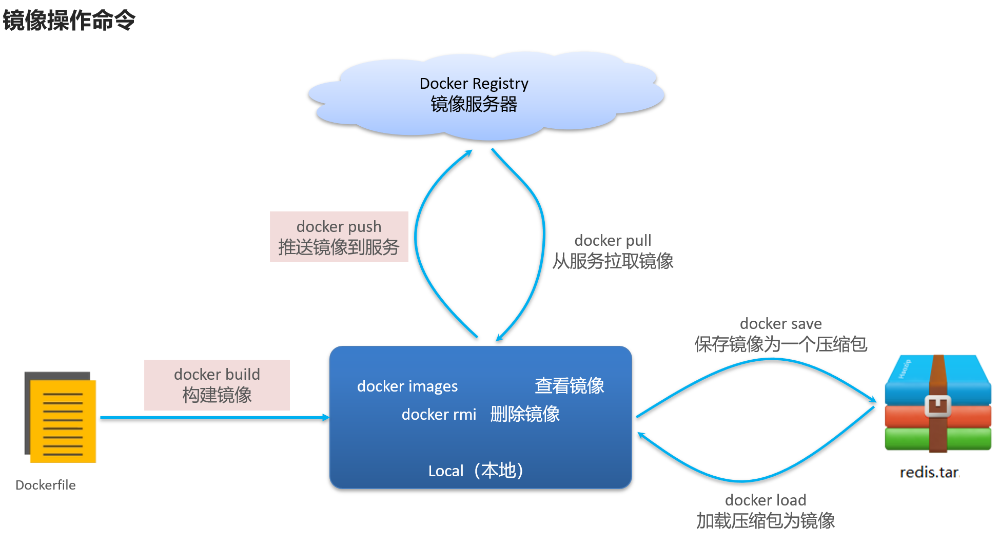
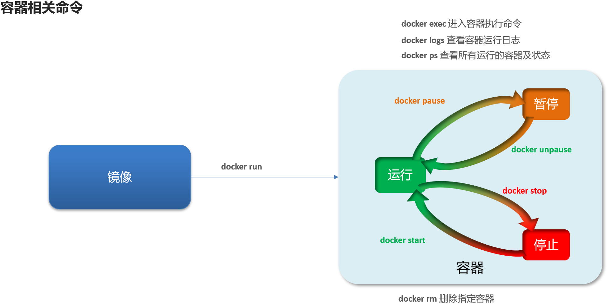

 # docker
- [用户权限相关](#用户权限相关)
- [镜像操作](#镜像操作)
- [容器操作](#容器操作)
  - [关于`docker run`:](#关于docker-run)
  - [关于`docker logs`:](#关于docker-logs)
  - [关于`docker ps`:](#关于docker-ps)
  - [关于`docker rm`](#关于docker-rm)
  - [利用`docker exec`开启容器内命令行:](#利用docker-exec开启容器内命令行)
- [数据卷](#数据卷)
  - [数据卷挂载](#数据卷挂载)
  - [操作数据卷](#操作数据卷)
- [Dockerfile自定义镜像](#dockerfile自定义镜像)
  - [什么是Dockerfile](#什么是dockerfile)
  - [Dockerfile语法](#dockerfile语法)
  - [构建镜像](#构建镜像)
- [容器网络](#容器网络)
- [Docker Compose](#docker-compose)
  - [什么是Docker Compose](#什么是docker-compose)
  - [Docker Compose的命令格式](#docker-compose的命令格式)

## 用户权限相关
Docker利用Linux的用户和组权限来管理对Docker守护进程的访问权限.一般情况下.只有root用户和属于docker用户组的用户才被允许访问Docker守护进程.在Linux系统上使用 Docker时.如果您尚未配置docker用户组.那么作为非root用户执行Docker相关命令将要求使用sudo来提升权限.可以将用户加入docker组解决.

## 镜像操作
镜像名格式 `[repository]:[tag]`,tag留空则默认为latest,代表最新版本的镜像.

## 容器操作

### 关于`docker run`:
- 当运行**没有固定进程**的容器 **-it** 参数,否则容器在开始后发现无任务就会立即停止运行.
- 一般使用`-d`参数在后台运行
- 可选项列表:

|参数|说明|
|:---:|:---:|
|`-a stdin`|指定标准输入输出内容类型,可选STDIN/STDOUT/STDERR三项|
|`-d`|后台运行容器,并返回容器ID|
|`-i`|以交互模式运行容器,通常与-t同时使用|
|`-P`|随机端口映射,容器内部端口随机映射到主机的端口|
|`-p`|指定端口映射,格式为：`[主机(宿主)端口]:[容器端口]`|
|`-t`|为容器重新分配一个伪输入终端,通常与`-i`同时使用|
|`--name="nginx-lb"`|为容器指定一个名称|
|`--dns 8.8.8.8`|指定容器使用的DNS服务器,默认和宿主一致|
|`--dns-search example.com`|指定容器DNS搜索域名，默认和宿主一致|
|`-h "mars"`|指定容器的hostname|
|`-e username="ritchie"`|设置环境变量|
|`--env-file=[]`|从指定文件读入环境变量|
|`--cpuset="0-2"`or`--cpuset="0,1,2"`|绑定容器到指定CPU运行|
|`-m`|设置容器使用内存最大值|
|`--net="bridge"`|指定容器的网络连接类型，支持 bridge/host/none/container四种类型|
|`--link=[]`|添加链接到另一个容器|
|`--expose=[]`|开放一个端口或一组端口|
|`--volume,-v`|绑定一个卷|

### 关于`docker logs`:
- 添加 -f 参数可以持续查看日志

### 关于`docker ps`:
- 添加-a参数查看所有状态的容器

### 关于`docker rm`
- 不能删除运行中的容器,除非添加 -f 参数

### 利用`docker exec`开启容器内命令行:
>`docker exec -it [容器名] bash`

解读:
- docker exec :进入容器内部,执行一个命令
- `-it` : 给当前进入的容器创建一个标准输入、输出终端,允许我们与容器交互
- `bash`:进入容器后执行的命令,bash是一个linux终端交互命令

注意:exec命令可以进入容器修改文件,但是在容器内修改文件是不推荐的.

## 数据卷

### 数据卷挂载
`docker run`的命令中通过`-v`参数挂载文件或目录到容器中:
1. volume名称:容器内目录
2. 宿主机文件:容器内文件
3. 宿主机目录:容器内目录

对比:  
- 数据卷挂载耦合度低,由docker来管理目录,但是目录较深,不好找.  
- 目录挂载耦合度高,需要我们自己管理目录,不过目录容易寻找查看.

### 操作数据卷
数据卷操作的基本语法如下:
>`docker volume [COMMAND]`

dockervolume命令是数据卷操作，根据命令后跟随的command来确定下一步的操作：
|命令|说明|
|:---:|:---:|
|`create`|创建一个volume|
|`inspect`|查看一个或多个volume的信息|
|`ls`|列出所有的volume|
|`prune`|删除所有的没有使用的volume|
|`rm`|删除一个或多个指定的volume|

## Dockerfile自定义镜像

### 什么是Dockerfile
Dockerfile就是一个文本文件,其中包含一个个的指令(Instruction),用指令来说明要执行什么操作来构建镜像.每一个指令都会形成一层Layer.

### Dockerfile语法
|命令|说明|示例|
|:---:|:---:|:---:|
|`FROM`|指定基础镜像|`FROM centos:6`|
|`ENV`|设置环境变量,可在后面指令使用| `ENV key value`|
|`COPY`|拷贝本地文件到镜像的指定目录|`COPY ./mysql-5.7.rpm /tmp`|
|`RUN`|执行Linux的shel命令,一般是安装过程的命令|`RUN yum install gcc`|
|`EXPOSE`|指定容器运行时监听的端口,是给镜像使用者看的|`EXPOSE 8080`|
|`ENTRYPOINT`|镜像中应用的启动命令,容器运行时调用|`ENTRYPOINT java -jar xx.jar`|

[详细内容](https://www.runoob.com/docker/docker-dockerfile.html)

### 构建镜像
当编写好了Dockerfile,可以利用下面命令来构建镜像:
>`docker build -t myImage:1.0 .`
- `-t`:是给镜像起名,格式依然是repository:tag的格式,不指定tag时,默认为latest.
- `.`:是指定Dockerfile所在目录，如果就在当前目录则指定为"."

## 容器网络
默认情况下，所有容器都是以bridge方式连接到Docker的一个虚拟网桥docker0上.容器之间可以通过容器名或id进行ping通信.
加入自定义网络的容器才可以通过容器名互相访问，Docker的网络操作命令如下:
|命令|说明|
|:---:|:---:|
|`docker network create`|创建一个网络|
|`docker network ls`|查看网络列表|
|`docker network rm`|删除一个网络|
|`docker network prune`|删除所有没有容器连接的网络|
|`docker network connect`|将一个容器连接到一个网络|
|`docker network disconnect`|将一个容器从网络断开|
|`docker network inspect`|查看网络的详细信息|

## Docker Compose

### 什么是Docker Compose
Docker Compose是一个用于定义和运行多容器Docker应用程序的工具.通过Compose,我们可以使用一个单独的docker-compose.yml模板文件（YAML格式）来配置应用程序需要的所有服务.然后使用一个命令,即可从YAML文件配置中创建并启动所有服务,帮助我们实现多个相互关联的Docker容器的快速部署.

### Docker Compose的命令格式
>`docker compose [options] [COMMAND]`

常用命令:
|类型|参数或命令|说明|
|:---:|:---:|:---:|
|Options|`-f`|指定compose文件的路径和名称|
|Options|`-p`|指定project名称|
|Commands|`up`|创建并启动所有service容器(`-d`后台运行)|
|Commands|`down`|停止并删除所有service容器|
|Commands|`start`|启动已经存在的service容器|
|Commands|`stop`|停止已经运行的service容器|
|Commands|`restart`|重启已经存在的service容器|
|Commands|`logs`|查看service的日志信息|
|Commands|`ps`|列出所有已经启动的service容器|
|Commands|`top`|查看service的进程信息|
|Commands|`exec`|在已经存在的service容器中执行命令|

[详细教程](https://www.runoob.com/docker/docker-compose.html)